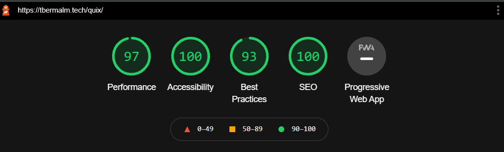

# Quix - ~~https://tbermalm.tech/quix/~~
This is a tool for indexing IMDB ratings by movie titles. There is also support for storing selected movies in a database, which is accessed through a personal account. Google Chrome Lighthouse: 97-100-93-100

## Why
Primarily, I wanted to teach myself web technologies through starting _and finishing_ a personal project involving api technology, CSS, HTML, JS and database functionality.

Additionally, I wanted to build something I have use for and can enjoy. Therefore, it's meant to adress that specific moment (which I very often find myself in) when you're trying to find a movie with a decent rating to watch with a group of people. You liked one of the titles, but the rest  of you didn't? Save to favourites, move on.

Finally, I wanted to build solid foundational knowledge of the standard web development languages, without any frameworks. I imagine this will serve as a more sustainable and long-term approach to web development, rather than jumping from framework to framework, without having learned the "basics".

## Tech
This project used the following technologies:

#### The omdbAPI (http://www.omdbapi.com/)
As an introduction to API's, it was rather convienient to use. However, the documentation didn't consist of anything more than a few tables with parameter functionality and two query examples. As this was a first look at APIs in general, I resorted to experimenting with different parameter values and inspecting the object which the API call returned. This led to me having to reformat my structure once or twice. For example, once I realised one of the two indexing methods (by imdbID and query by title) contain different properties (such as rating, poster and cast), I restructred the information so that every search would gather a complete set of movie properties. This caused inefficiency (two api calls, although asynchronously) but seemed to be a necessary solution since every search required properties from both indexing methods.

#### HTML5/CSS3/Javascript ES6
I purposefully decided to avoid any frameworks or libraries as learning the foundations of vanilla html/css/js is a much better first-step than going straight to React, for example. Once I learn a frameowork, this will allow me to better understand and utilize the frameworks for their strengths - in situations where they are advantageous.  I now have a much better grip on the languages, as well as their strengths and weaknesses. For example, generating html through js was an extremely verbose and awkward process. As far as I know, React also allows you to write HTML, CSS and JS in once place. This would be of use, since locating where I manipulated a certain element quickly got confusing since it was potentially handled through any of the three languages.

#### Firebase Realtime Database
This database service worked perfectly. It was also my first interaction with the JSON format, which was nice to get familiar with since it's so commonly used. I've previously worked with relational databases (MSSQL, mainly). Therefore, working with a NoSQL database served as a rewarding oppurtunity to explore another approach to databases and its functionalities. Firebase Realtime Databases is also accessible from client devices which of course is a must, given that the user will read the database from their own device.

#### Other
Version control is Git & Github Desktop. Developed from IntelliJ IDEA and Firefox Developer Edition, but it's built to work on all modern browsers and devices.

## Lessons learned
#### Throroughly reasearch and plan the project
As this was more or less my first interaction with the technologies mentioned above, it wasn't sensible to start developing the website without having considered, at least in some detail, the core information flow, layout, use case and most features. However, having an idea of how you want things to work within a collections of tools you are not familiar with is not an easy thing. With these things in mind, what I'd do for the next project is to start writing code but treat it as a first revision. When I would've achieved some sense of familiary with the project and the tools, I'd throw the first revision out the window then research, plan and then come up with a more robust and sustainable project outline.

#### Take breaks
I have to some extent run into this valuable lesson before, but it was much clearer just how important this is. With other skills or hobbies, it's entirely possible to simply grind it out, but is not sustainable for outputting high quality code and solutions. The second you start to blindly stare at the characters, make funny mistakes or make no progress towards a problem you need to take a break. Leaving your computer for five minutes to take a walk and a snack will pay you back tenfold in terms of code quality and efficiency.

#### Mobile first
In hindsight, it's evident that I should've employed a mobile first approach, mainly because the website is primarily used from mobile devies. Currently, it's written with desktops as a primary case and breakpoints for responsiveness. However, scaling up from mobile is a lot more sustainable than scaling down from desktop. Especially when the primary use case is from mobile devices.
